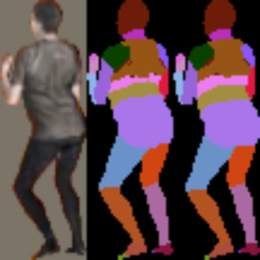
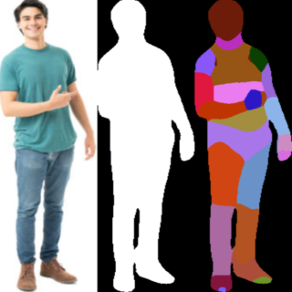

# SurrealExps

This repository contains PyTorch code to train and evaluate the built-in TorchVision models for segmentation on the task of human parsing/part segmentation
on the Surreal dataset, for the models LRASPP, DeepLabv3 with Resnet50 and Resnet101 backbones. 

# Installation
Run install.sh, tested on PyTorch version 2.2.2, torchvision version 0.17.2, Cuda 12.1, and python 3.10. The ultralytics package
package is only necessary for in the wild inference.

# Data Pre-Processing
The data can be downloaded here: https://www.di.ens.fr/willow/research/surreal/

Write the path of the original data in the first line of Dataset_Location.txt.
The second line of that file should be where you want to save individual frames
for training/validation/testing. 

I do not use the entire dataset, but roughly about 1/15 of the total number of frames.
Rather than decode videos during training/inference you can write your own vid_frame pairs using get_vid_frame_pairs(...) in data_preprocess.py, 
or just use the included video frame pair text files in ~/Dataloaders/vid_fp_frame_pairs/. 

Afterwards, run write_surreal_dataset_frames() 
in ~/Dataloaders/data_preprocess.py to write the frames needed for training. You may need to update
the number of processes you use according to your CPU specs.

# Training and Inference:
Run train_rgb.sh, adjusting gpus used with the --gpu_override flag. I used 2 gpus with 24 GB of VRAM, and a batch size of 128. For single
GPU training, I recommend a batch size of 64 images and 16-bit mixed precision training.  

# Eval Results
| Model | LR ASPP | DeepLabv3-Resnet50 | DeepLabv3-Resnet101 |
|---|---|---|---|
| Mean IoU (%) | 73.4 | 84.0 | 85.0|
| Pixel Accuracy (%) | 89.9 | 94.0 | 94.4|


# Sample test set inference: DeepLabv3-Resnet101





# Sample in the wild inference
With Yolov8 instance segmentation and DeepLabv3-Resnet101 part segmentation ...


# Citations
Please cite the Surreal dataset if you end up using any of this in a paper. 

```bibtex
@INPROCEEDINGS{varol17_surreal,
  title     = {Learning from Synthetic Humans},
  author    = {Varol, Gül and Romero, Javier and Martin, Xavier and Mahmood, Naureen and Black, Michael J. and Laptev, Ivan and Schmid, Cordelia},
  booktitle = {CVPR},
  year      = {2017}
}
